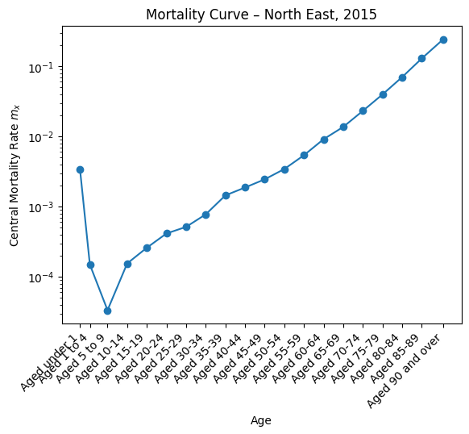
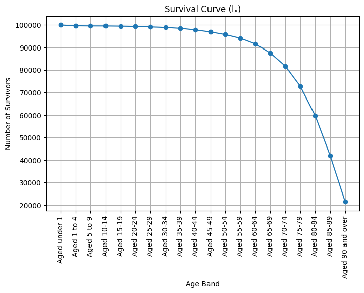
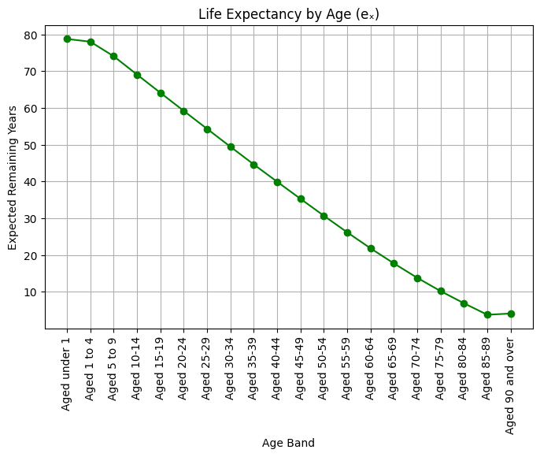

# Life Table for the North East (2015)

## Overview
This project constructs a complete actuarial life table for the North East region of England in 2015 using ONS mortality and population data. It calculates central mortality rates $m_x$, death probabilities $q_x$, and the full set of life table functions, including survival counts, person‑years lived, and remaining life expectancy.

## Method
- Filter ONS deaths and population data for the chosen region and year.
- Compute $m_x$ and to convert to $q_x$.
- Build life table columns: $p_x,l_X,d_X,L_x,T_x,e_x$.
- Apply an open‑ended age‑band closure for ages 90+.
- Validate results against ONS life expectancy ranges.

## Life Table Columns (Brief)
- $m_x$ — central mortality rate for each age band.
- $q_x$ — probability of dying within the age interval.
- $p_x$ — probability of surviving the interval.
- $l_x$ — number of survivors at the start of each age band (starting from 100,000).
- $d_x$ — number of deaths in the interval.
- $L_x$ — person‑years lived in the interval.
- $T_x$ — total future person‑years above age $x$.
- $e_x$ — remaining life expectancy at age $x$.

## Results 
The constructed life table for the North East (2015) produces the following key outputs:
- **Life expectancy at birth**: 78.8 years
- **Life expectancy at age 65**: 17.8 years
- **Mortality curve**: shows increasing mortality rates with age, with a steep rise after age 70.

- **Survival curve**: shows the decline of a 100,000‑life cohort, remaining stable through mid‑life and falling sharply in older ages.

- **Life expectancy curve**: shows expected remaining years decreasing smoothly with age, consistent with ONS patterns.

## Data Source
Mortality and population data obtained from the ONS NOMIS service:
https://www.nomisweb.co.uk/
The data was acessed using the NOMIS API.

## Purpose
The aim of this project is to show how basic mortality data can be turned into a full life table for the North East of England in 2015. It walks through each step in a straightforward way, from preparing the data to calculating survival patterns and life expectancy at different ages. The project is designed to be easy to follow for anyone who is new to actuarial work, while still showing how these methods are used to understand how long people are expected to live in a population.

